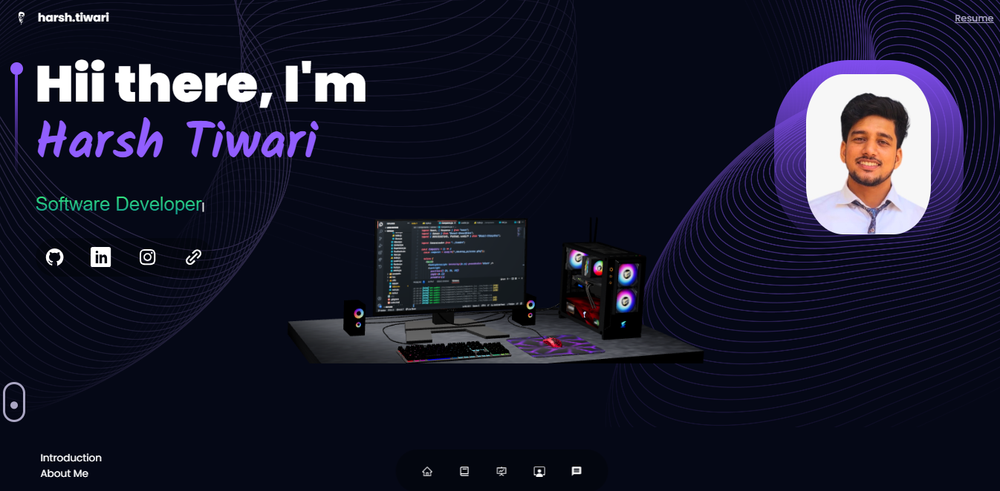
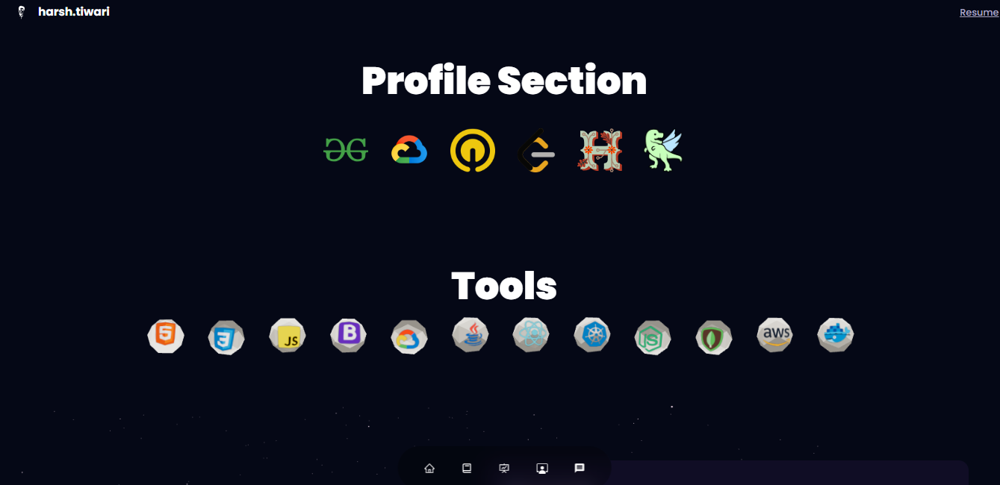
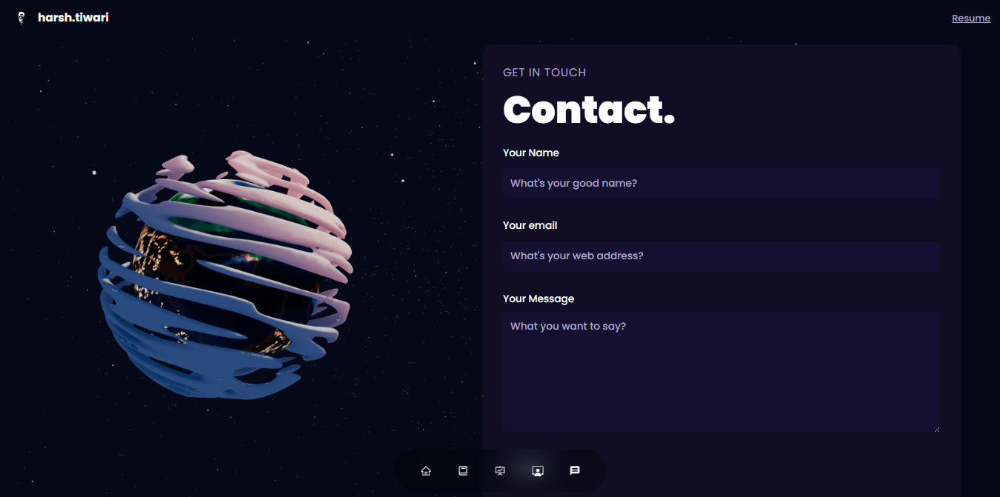

# 🌐 3D React Portfolio

[](https://imharshtiwari.github.io/3d-react-portfolio/)
[](https://vitejs.dev/)
[](#license)

🚀 **3D React Portfolio** is a modern and interactive personal portfolio website built with **React**, **Vite**, and **Three.js** to showcase your work in a visually compelling way. It's animated, responsive, and full of smooth transitions powered by Framer Motion and WebGL.

🔗 **Live Demo:** [https://imharshtiwari.github.io/3d-react-portfolio](https://imharshtiwari.github.io/3d-react-portfolio)

---

## ✨ Features

- 🎨 Sleek, animated UI with Material UI and Tailwind CSS
- 🌐 3D visuals and scenes with React Three Fiber and Drei
- 💌 Email integration with EmailJS
- 🔠 Typing animation with Typed.js and iTyped
- 🎥 Smooth transitions using Framer Motion
- 🧭 React Router for navigation
- 📱 Fully responsive design

---

## 🧰 Tech Stack

- **Frontend:** React, Vite, JavaScript
- **Styling:** Tailwind CSS, Sass, Emotion, MUI
- **3D Engine:** Three.js, @react-three/fiber, Drei
- **Animation:** Framer Motion, Typed.js, iTyped
- **Utilities:** EmailJS, React Icons, Vertical Timeline

---

## ⚙️ Installation & Development

Make sure you have **Node.js** and **npm** installed.

```bash
# 1. Clone the repository
git clone https://github.com/imharshtiwari/3d-react-portfolio.git

# 2. Navigate into the directory
cd 3d-react-portfolio

# 3. Install dependencies
npm install

# 4. Start the development server
npm run dev

```
## 📁 Folder Structure
```
├── public/              # Static assets
├── src/
│   ├── assets/          # Media & icons
│   ├── components/      # Reusable components
│   ├── pages/           # Main sections like About, Projects
│   ├── styles/          # Tailwind & Sass styling
│   └── App.jsx          # Main App entry
├── vite.config.js       # Vite configuration
└── package.json         # Project metadata & scripts
```
## 🖼️ Screenshots






---

## 🙌 Let's Connect!

If you like this project, feel free to give it a ⭐ and share it!

Follow me for more:

[](https://imharshtiwari.github.io/3d-react-portfolio)
[](https://www.linkedin.com/in/the-harsh-tiwari)
[](https://github.com/imharshtiwari)
[](https://twitter.com/imharshtiwari)

---

### 💬 Feedback

Got feedback or ideas? Open an [issue](https://github.com/imharshtiwari/3d-react-portfolio/issues) or drop me a message. I’d love to hear from you!

---

> 🚀 *"Keep building. Keep learning. Your portfolio is your voice on the web."*

